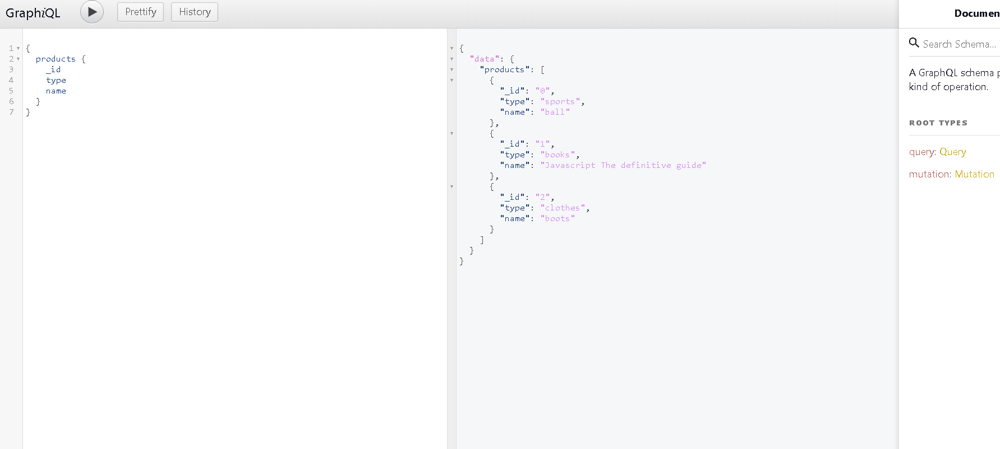

## Backend with node mongoose and graphql

In this repo I just create a database with Mongo and Mongoose and implement the power of GraphQL to get only the data I want in every case. I created some mutation methods as update or delete as well.

As the graphql interface shows below, I only get the data of every product I ask for:

